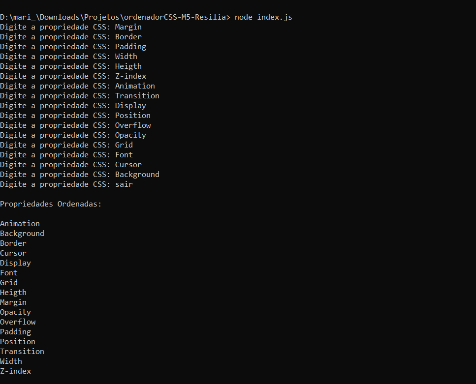

# CSS organizer - CLI app
CSS order CLI app to use in the command line. Developed with node.js

## Goal
To create a terminal tool where the developer can write the css properties and the program will return as order list. 

## Technologies Used
Node.js and prompt-sync library

## Testing

